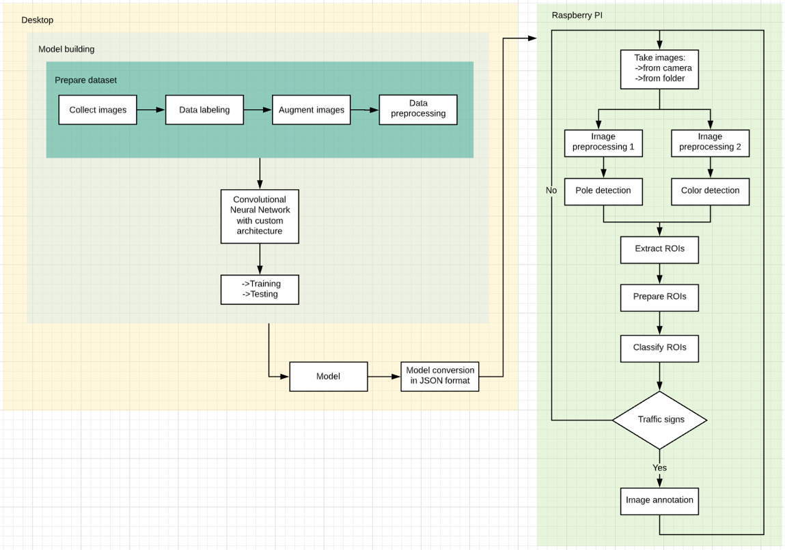

# Traffic Signs Recognition

### Real-time traffic signs detection and recognition module for Raspberry Pi

This module represents a component of a 1/10 scale autonomous car that the Back On Track team competed with at the Bosch Future Mobility Challenge 2020. It was designed to detect four types of miniature road signs positioned on poles.

## Features

- Does not require calibration
- Two image preprocessing pipelines that run in parallel:
  - Pillar-based ROI extraction
  - Detection based on color segmentation
- Robust to occlusions and inaccurate color representation
- Optimized convolutional neural network
- Inference is done directly in C++
- Computes distances to sign

## Diagram

## Performance

- The system runs at 6-10 FPS on a single core of a Raspberry Pi 4 while capturing images in real time.
- It classifies traffic signs with an accuracy of 95.85%. 

## Appendix

- For more information, please refer to the detailed presentation and paper that are placed in [this directory](./paper_presentation/).

## License

[GNU GPLv3](https://choosealicense.com/licenses/gpl-3.0/)
